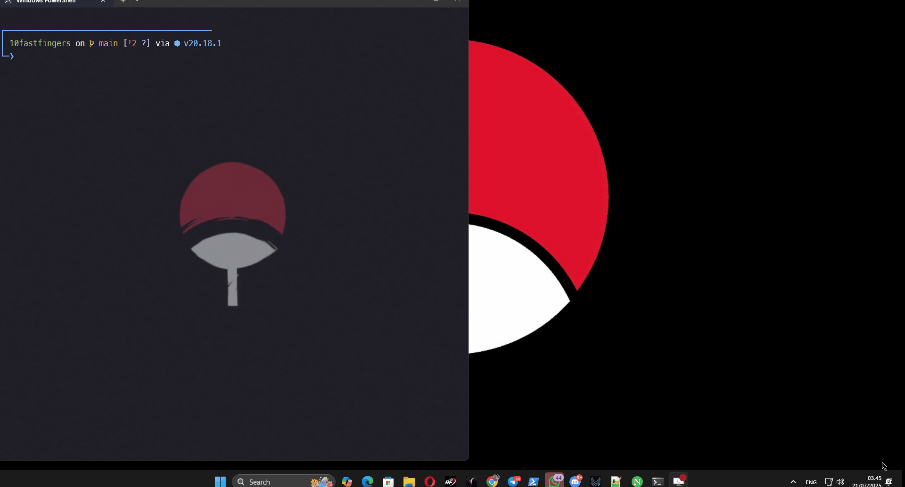

# ⚡ 10FastFingers Automation Bot





## 📦 Features

- ✅ **Basic / Advanced Typing Test automation**
- ✅ **Competition mode support**
- ✅ **Dynamic WPM simulation with realistic presets:**
  - Human - Normal (100-115 WPM)
  - Human - Fatigue (90-110 WPM)
  - Pro - Fast player (130-145 WPM)
  - Random Natural Feel (100-140 WPM)
- ✅ **Human-like typing behavior:**
  - Per-character delay variations
  - Occasional typos
  - Auto-adjust typing speed PID control
- ✅ **Auto-login with cookie management**
- ✅ **Language support:** English, Indonesian
- ✅ **Configurable via `control.json` or presets**
- ✅ **Headless or visible browser mode**

---

## 🚀 Usage

### 1️⃣ Install dependencies:
```bash
npm install
```

### 2️⃣ Run the bot:
```bash
node bot.js
```

### 3️⃣ Follow CLI prompts:
- **Enter profile name** (cookies saved in `/profiles`)
- **Choose headless mode** (YES / NO) | 
**Headless mode explanation:**
- **YES (headless):** The browser runs in the background without showing a window.
- **NO (non-headless):** The browser window is visible so you can watch the typing ( Recommended )

- **Select mode:**
  - Basic Typing Test
  - Advanced Typing Test
  - Competition
- **Select language:**
  - English
  - Indonesian
- **Select typing style preset:**
  - Human - Normal: 100-115 WPM
  - Human - Fatigue: 90-110 WPM (gradual fatigue)
  - Pro - Fast player: 130-145 WPM consistently fast
  - Random Natural Feel: 100-140 WPM mixed style
## 💬 Issues / Discussions

Found a bug? Have suggestions or ideas for improvements?  
Feel free to [open an issue](https://github.com/justhalooo/10fastfingers-bot/issues) or start a [discussion](https://github.com/justhalooo/10fastfingers-bot/discussions).  

We welcome feedback and contributions! 🎉
